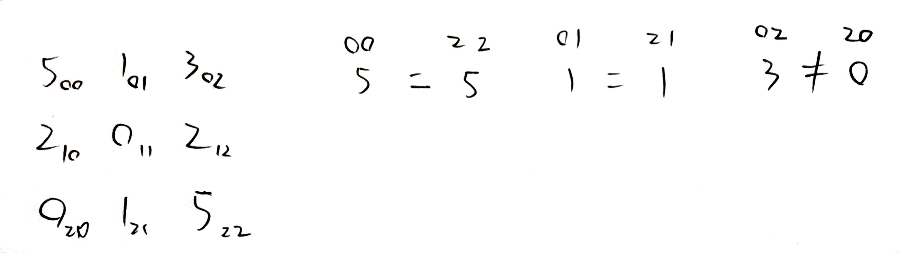

# UVa 11349 - Symmetric Matrix

## Link

https://onlinejudge.org/external/113/11349.pdf

## onClass

Result: Wrong answer

```cpp
#include <iostream>

using namespace std;
using LL = long long;

int main()
{
	int t = 0; // number of test cases
	int counter = 0;
	cin >> t;
	while (t--)
	{
		counter++;

		char c1, c2;
		int n = 0; // the dimension of square matrix
		cin >> c1 >> c2 >> n;

		// n * n matrix
		LL** a = new LL* [n];
		for (int i = 0; i < n; i++)
			a[i] = new LL[n];

		for (int row = 0; row < n; row++)
		{
			for (int col = 0; col < n; col++)
			{
				cin >> a[row][col];
			}
		}

		bool isSymmetric = true;
		for (int row = 0; row < n; row++)
		{
			for (int col = 0; col < n; col++)
			{
				if (a[row][col] != a[col][row])
				{
					isSymmetric = false;
					break;
				}
				if (a[row][col] < 0)
				{
					isSymmetric = false;
					break;
				}
			}
			if (isSymmetric == false)
				break;
		}

		cout << "Test #" << counter << ": ";
		if (isSymmetric == true)
			cout << "Symmetric." << endl;
		else
			cout << "Non-symmetric." << endl;

        for (int i = 0; i < n; i++)
			delete [] a[i];
        delete [] a;
	}
}
```

## Analysis

在寫這題時，因為時間不夠，我直接用數學中矩陣對稱 $a_{ij} = a_{ji}$ 的方法判定，但這樣跟題目是不一樣的，題目有自己的判定方法。



## afterClass_v1

Result: accepted

```cpp
#include <iostream>

using namespace std;
using LL = long long;

int main()
{
	int t = 0; // number of test cases
	int counter = 0;
	cin >> t;
	while (t--)
	{
		counter++;

		char c1, c2;
		int n = 0; // the dimension of square matrix
        bool isSymmetric = true;

		cin >> c1 >> c2 >> n;

		// n * n matrix
		LL** a = new LL* [n];
		for (int i = 0; i < n; i++)
			a[i] = new LL[n];

		for (int row = 0; row < n; row++)
		{
			for (int col = 0; col < n; col++)
			{
				cin >> a[row][col];
                if (a[row][col] < 0)
                    isSymmetric = false;
			}
		}

		for (int row = 0; row <= n / 2; row++) // 只需檢查上半部
		{
			for (int col = 0; col < n; col++)
			{
				if (a[row][col] != a[n - 1 - row][n - 1 - col])
				{
					isSymmetric = false;
					break;
				}
			}
			if (isSymmetric == false)
				break;
		}

		cout << "Test #" << counter << ": ";
		if (isSymmetric == true)
			cout << "Symmetric." << endl;
		else
			cout << "Non-symmetric." << endl;
	}
}
```

```cpp
if (a[row][col] != a[n - 1 - row][n - 1 - col])
{
    isSymmetric = false;
    break;
}
```