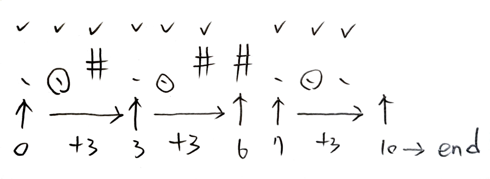

# UVa 12405 – Scarecrow

## Link

https://onlinejudge.org/external/124/12405.pdf

## onClass

### Thinking Logic and Solution Strategy

```
10
....##..#.
Case 3: 4

1
5
.....
Case 1: 2

10
..#..##...
Case 7: 4 // true ans is 3

# 分區塊

. -> 1
.. -> 1
... -> 1
...# -> 1
...## -> 1
...##. -> 2
.(.).##.(.) -> 2
.(.).##.(.). -> 2
.(.).##.(.).(.) -> 3
.(.).##.(.).(.)## -> 4
```

### Code

result: wrong answer

```cpp
#include <iostream>
#include <vector>
#include <string>
#include <cmath>

using namespace std;

int main()
{
	int T;
	cin >> T;
	int caseNum = 0;
	while (T--)
	{
		caseNum++;
		int size = 0;
		cin >> size;
		string field;
		cin >> field;

		int crowNum = 0;
		int tempDotCount = 0;

		for (int i = 0; i < size; i++)
		{
			if (field.at(i) == '.')
			{
				tempDotCount++;
			}
			else // '#'
			{
				crowNum += ceil(static_cast<double>(tempDotCount) / 3.0);
				tempDotCount = 0;
			}
		}
		if (tempDotCount > 0)
			crowNum += ceil(static_cast<double>(tempDotCount) / 3.0);

		cout << "Case " << caseNum << ": " << crowNum << endl;
	}
}
```

## afterClass_v1

### Thinking Logic and Solution Strategy

```
如果接下來三個有任何一個 '.'
    crow++
```

### Code

result: wrong answer

```cpp
#include <iostream>
#include <vector>

using namespace std;

int main()
{
    int t = 0;
    cin >> t;
    int counter = 0;
    while (t--)
    {
        counter++;
        int n = 0;
        cin >> n;
        vector<char> field(n);
        for (int i = 0; i < n; i++)
            cin >> field.at(i);

        int crow = 0;
        for (int i = 0; i < n; i += 3)
        {
            int j = 0;
            if (i + 2 > n - 1)
                j = n - 1;
            else
                j = i + 2;

            for (int k = i; k <= j; k++)
            {
                if (field.at(k) == '.')
                {
                    crow++;
                    break;
                }
            }
        }
        cout << "Case " << counter << ": " << crow << endl;
    }
}
```

## afterClass_v2

### Thinking Logic and Solution Strategy

> #### 解題新方向：貪婪演算法 (Greedy Algorithm)
> 
> 要解決這題，我們可以用「遇到需要才處理，並發揮最大效益」的策略。
> 
> 我們不要一開始就規定每次跳 3 格，而是**從最左邊開始一格一格往右掃描**（例如設定一個變數 `i` 從 `0` 走到 `n-1`），並根據當下看到的狀況來決定下一步該怎麼走：
> 
> 1. **狀況一：當你遇到 `#` (不能種植的土地) 時**
> * 這裡不需要種農作物，我們需要立刻放稻草人去保護它嗎？不需要。
> * **思考方向：** 我們直接往下看下一格就好了（也就是前進 **1** 步）。
> 
> 
> 2. **狀況二：當你遇到 `.` (可種植的農作物) 時**
> * 這個 `.` **必須**被保護，所以我們在這個區域附近一定要放一個稻草人。
> * 為了讓這個稻草人的保護範圍向右方「最大化」（順便保護後面的田），我們應該把稻草人放在當下位置 `i` 的右邊一格（也就是 `i+1`）。
> * 放在 `i+1` 後，它會保護到 `i`、`i+1`、`i+2` 這三格。
> * **思考方向：** 既然這三格都已經確保安全了，我們接下來就可以直接跳過這三格，從 `i+3` 開始繼續檢查（也就是前進 **3** 步，同時別忘了把稻草人數量 `+1`）。
> 
> 在寫程式時，你可以考慮使用 `while (i < n)` 迴圈，這樣能讓你更自由地根據條件來控制變數 `i` 每次要增加 `1` 還是增加 `3`。
>
> written by gemini



### Code

result: 

```cpp
#include <iostream>
#include <vector>

using namespace std;

int main()
{
    int T; // the number of test cases
    cin >> T;
    for (int caseNum = 1; caseNum <= T; caseNum++)
    {
        int N;
        cin >> N;
        vector<char> field(N);
        for (int i = 0; i < N; i++)
            cin >> field.at(i);

        int i = 0; // index
        int scarecrow = 0;
        while (i < N)
        {
            if (field.at(i) == '#')
            {
                i++;
            }
            else // field.at(i) == '.'
            {
                scarecrow++;
                // if i == 1
                // scarecrow put at 2
                // next check 1 + 3 == 4
                i += 3;
            }
        }

        cout << "Case " << caseNum << ": " << scarecrow << endl;
    }
}
```

## Analysis

> ### 最需要優先修改的地方：字串讀取方式
> 
> 雖然你的程式碼已經完全正確了，但在 C++ 中，處理連續的字元（例如 `..#..##`），有一種更簡潔、更習慣的寫法。
> 
> **目前的寫法：使用 `vector<char>` 逐格讀取**
> 
> ```cpp
> vector<char> field(N);
> for (int i = 0; i < N; i++)
    > cin >> field.at(i);
> ```
> 
> 這雖然沒錯，但寫起來比較冗長。
> 
> **建議修改：使用 `std::string` 一次讀取**
> 既然測資是一整串沒有空白的字元，你可以直接宣告一個字串，然後用 `cin` 一次把整行吃進來。其實你在 `onClass.cpp` 中曾經用過這個技巧！
> 
> 你可以把上面那段改成這樣：
> 
> ```cpp
> string field;
> cin >> field; // 直接讀取整串 "..#..##"
> ```
> 
> **這樣修改的好處：**
> 
> 1. **程式碼更短、更乾淨**：省去了一個 `for` 迴圈，整體結構看起來更清爽。
> 2. **效能更好**：`cin >> string` 的底層優化通常比逐字元跑迴圈讀取來得快。
> 3. **無縫接軌**：你下面的 `while` 迴圈完全不用改！因為 `std::string` 也可以像陣列一樣使用 `field.at(i)` 或 `field[i]` 來取得單一字元。
>
> written by gemini

## afterClass_v2_modified

```cpp
#include <iostream>
#include <string>

using namespace std;

int main()
{
    int T; // the number of test cases
    cin >> T;
    for (int caseNum = 1; caseNum <= T; caseNum++)
    {
        int N;
        cin >> N;
        string field;

        cin >> field;

        int i = 0; // index
        int scarecrow = 0;
        while (i < N)
        {
            if (field.at(i) == '#')
            {
                i++;
            }
            else // field.at(i) == '.'
            {
                scarecrow++;
                // if i == 1
                // scarecrow put at 2
                // next check 1 + 3 == 4
                i += 3;
            }
        }

        cout << "Case " << caseNum << ": " << scarecrow << endl;
    }
}
```